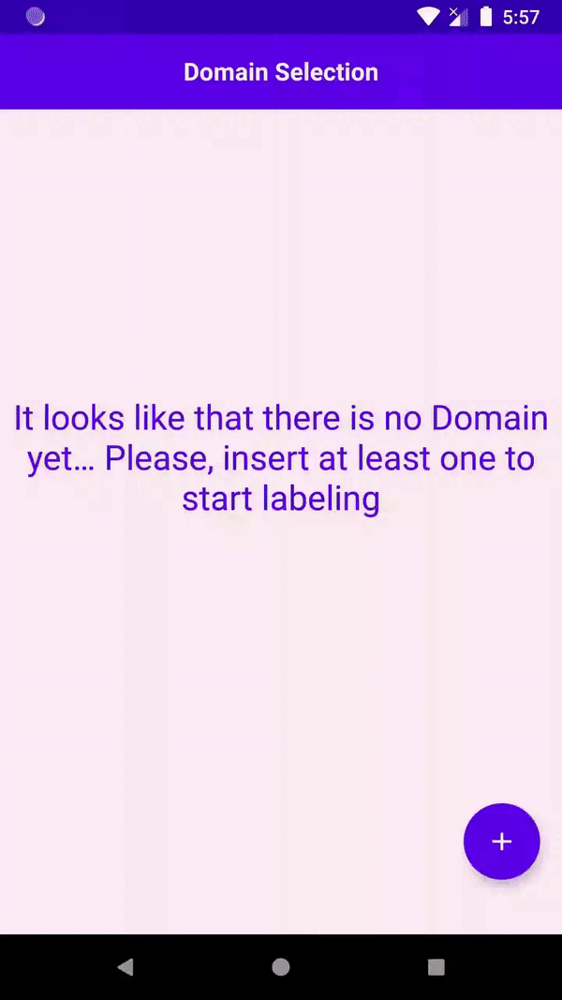
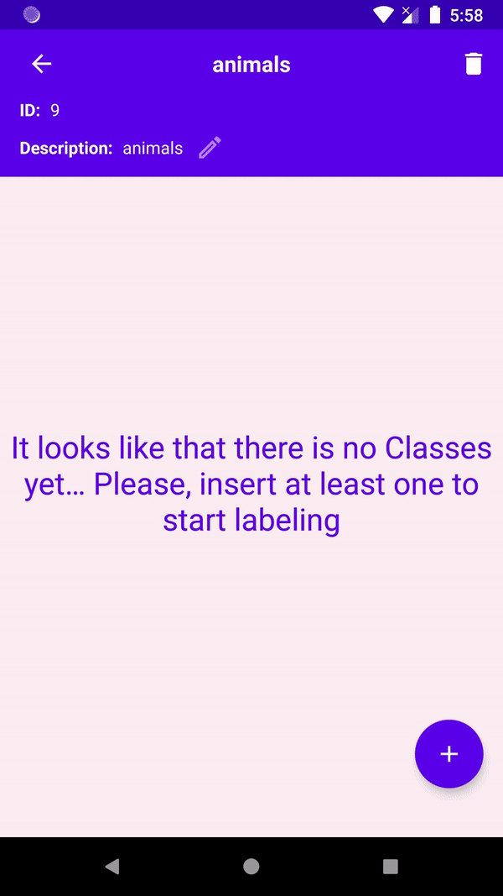
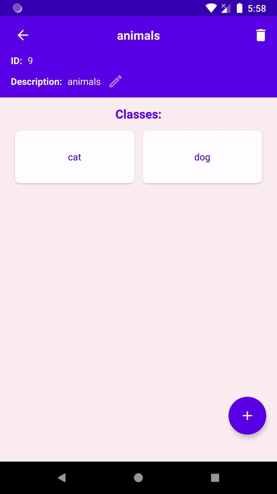

## Image Labeling System - Android
1. [Labeling images](#labeling-images)
2. [Simplified architecture](#simplified-architecture)
3. [Setting up the Android side - without Android Studio](#setting-up-the-android-side---without-android-studio)
4. [Setting up the Android side - with Android Studio](#setting-up-the-android-side---with-android-studio)
5. Setting up the API side - [go to the API repository](https://github.com/MaximoDouglas/image-labeling-api)

This is the Android app side of a project created to facilitate the __data acquisition__ and the __data labelling__ steps for supervised computer vision tasks. 

You just need to create an image __Domain__ (e.g. **animal**) and its __Classes__ (e.g. **Dog**, **Cat** and **Duck**) to start the labeling.

## Labeling images

1. In the first screen, create a new domain by tapping in the *plus* button. Let's call it "animals". This will lead you to Classes creation screen.
  * 
2. Create new classes, let's call them "cat" and "dog".
  * 
4. Tap on "dog". This will lead the user to the labeling screen. Tap on the search field and type the search term "puppy" to find images for the dog class and hit the search icon. Now you just need to "Confirm" or "Discard" images. 
  * 
9. When you think that it's enough for this search term, you can edit it and continue labeling for this class or go back and select another class to label. 
  * 

## Simplified architecture


## Setting up the Android side - without Android Studio

1. Install both Java 8 and the Android SDK (save the SDK location)
2. Inside the project root folder create a file named local.properties with the content as described bellow:
  ```
  sdk.dir=<your sdk location>
  RAPID_API_KEY="<your rapid API key>"
  IMAGE_LABELING_BASE_URL="http://<your API server IP>:<port>/"
  ```
5. To get and API Key, go to [this Rapid API page](https://rapidapi.com/microsoft-azure-org-microsoft-cognitive-services/api/bing-image-search1/)
6. To get the IMAGE_LABELING_BASE_URL please refer to the [API documentation](https://github.com/MaximoDouglas/image-labeling-api)
7. With all of this set up, you just need to run: `bash ./gradlew assembleDebug`
8. The result APK can be found at: ./app/build/outputs/apk/local/debug/app-local-debug.apk

## Setting up the Android side - with Android Studio
1. If you already run Android projects, you can just clone the project and create (if it was not already created) a file named local.properties with the following content:
```
  sdk.dir=<your sdk location>
  RAPID_API_KEY="<your rapid API key>"
  IMAGE_LABELING_BASE_URL="http://<your API server IP>:<port>/"
  ```
5. To get and API Key, go to [this Rapid API page](https://rapidapi.com/microsoft-azure-org-microsoft-cognitive-services/api/bing-image-search1/)
6. To get the IMAGE_LABELING_BASE_URL please refer to the [API documentation](https://github.com/MaximoDouglas/image-labeling-api)
7. With everything set up, you just need to run both the API and this project to start labeling.

